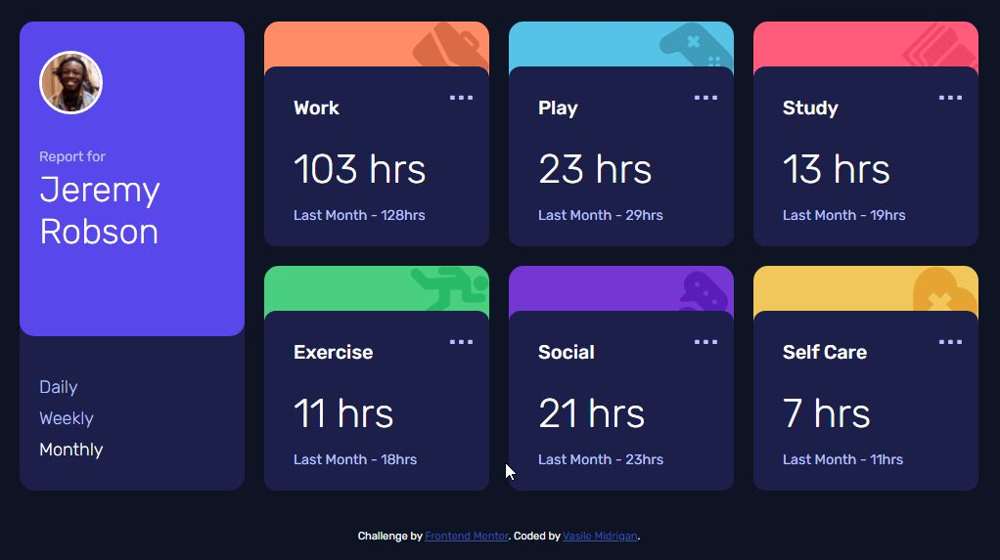
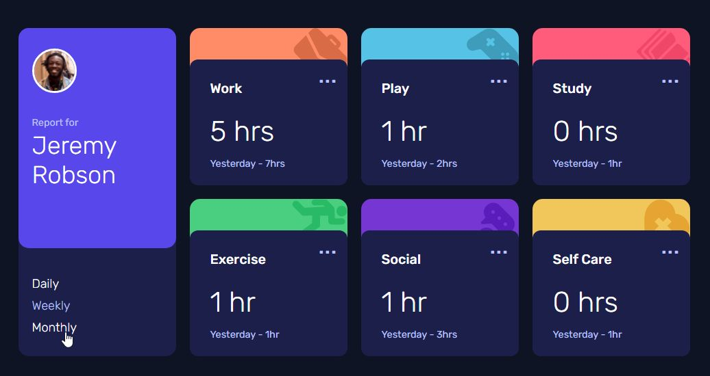
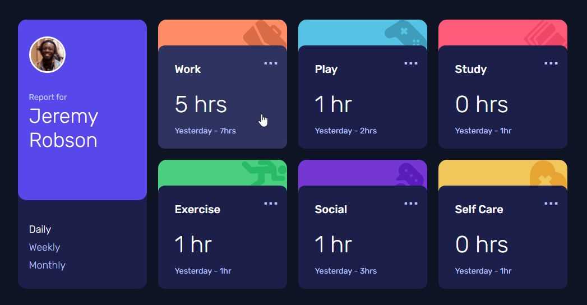
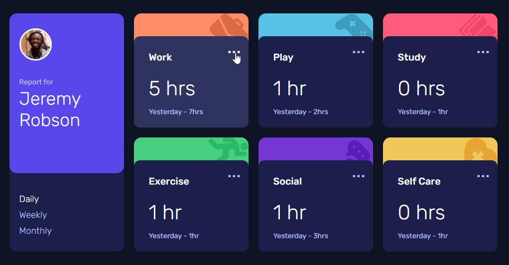
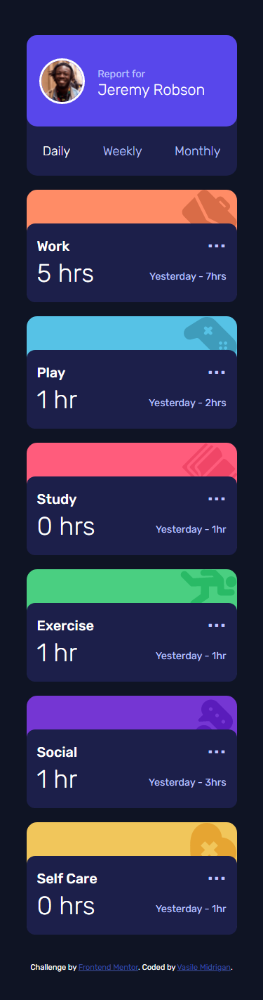
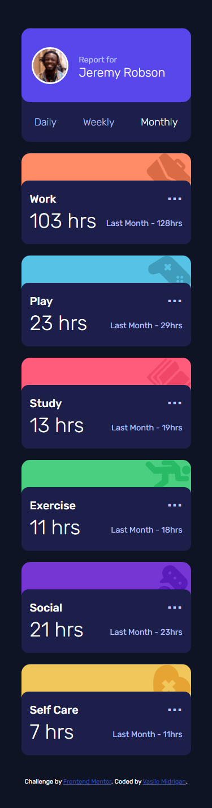

# Time tracking dashboard

## Table of contents

- [Overview](#overview)
  - [Project Objectives](#the-challenge)
  - [Screenshots](#screenshot)
  - [Links](#links)
- [My process](#my-process)
  - [Built with](#built-with)
- [Author](#author)

## Overview

### Project objectives:

Users should be able to:

- View the optimal layout for the site depending on their device's screen size
- See hover states for all interactive elements on the page
- Switch between viewing Daily, Weekly, and Monthly stats

### Screenshots

Desktop Version

Desktop Version - active state

Desktop Version - active state

Desktop Version - active state

Mobile Version Daily Data

Mobile Version Monthly Data

### Links

- Solution URL: [github repo](https://github.com/vasilemidrigan/time-tracking-dashboard)
- Live Site URL: [time-tracking-dashboard](https://vasilemidrigan.github.io/time-tracking-dashboard/)

## My process

### Built with

- Mobile-first workflow
- JavaScript
- JSON
- CSS Grid
- Flexbox
- CSS custom properties
- Semantic HTML5 markup

## Author

- Website - [vasilemidrigan.github.io](https://vasilemidrigan.github.io/)
- Github - [vasilemidrigan](https://github.com/vasilemidrigan)
- LinkedIn - [Vasile Midrigan](https://www.linkedin.com/in/vasile-midrigan/)
- Frontend Mentor - [@vasilemidrigan](https://www.frontendmentor.io/profile/vasilemidrigan)
